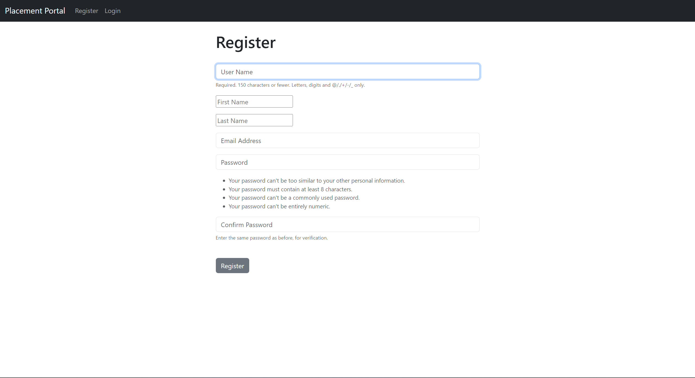
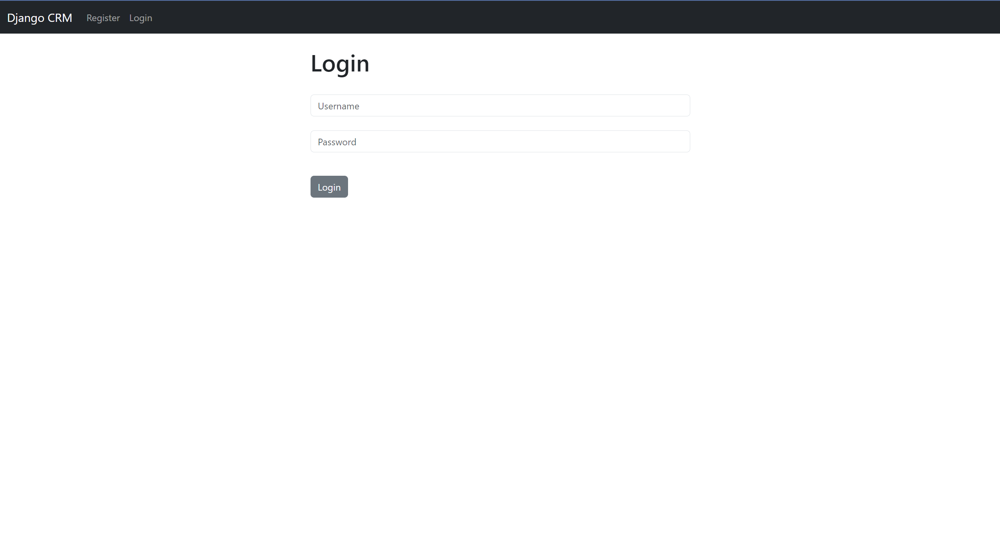
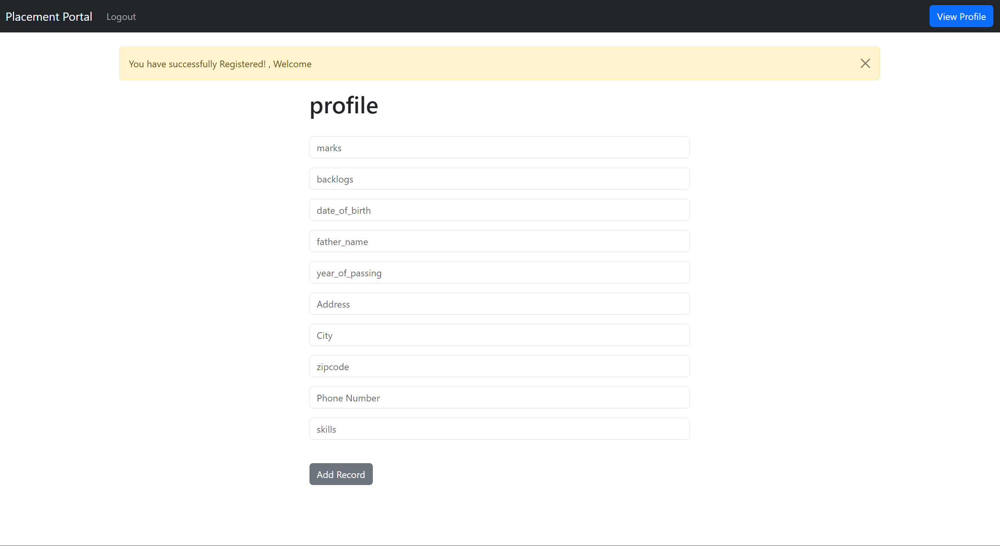
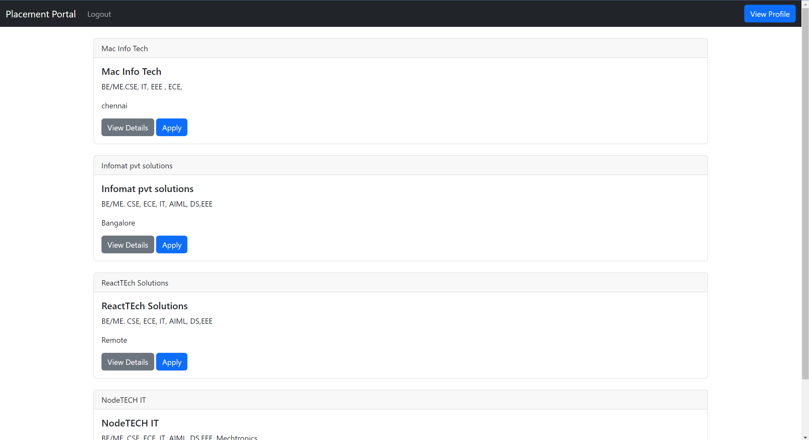
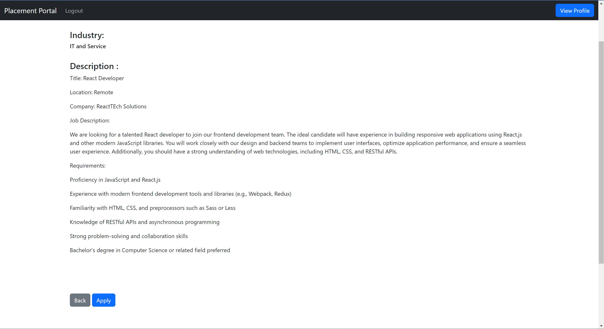
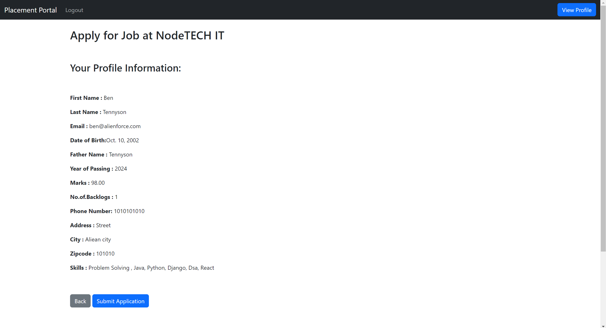
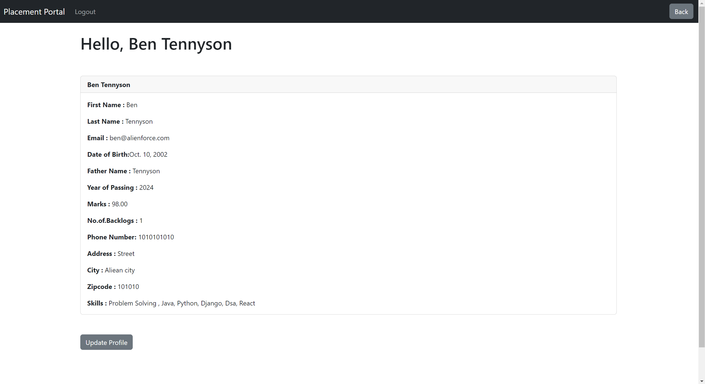
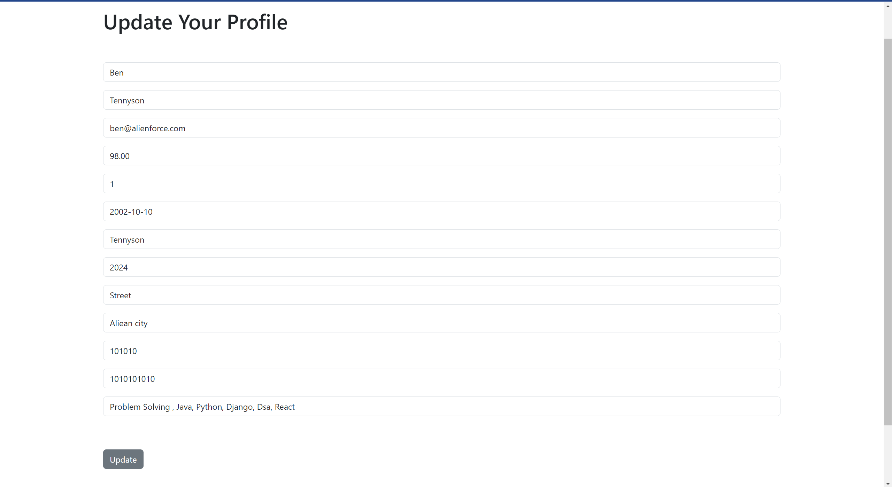

# Placement Portal
Welcome to the **Placement Portal**! This portal serves as a platform for students to explore and apply for placement opportunities provided by various companies. Here, students can register, create profiles, view company details, and apply for suitable positions.

## Table of Contents
1. [Introduction](#introduction)
2. [Features](#features)
3. [Technologies Used](#technologies-used)
4. [How to Use](#how-to-use)
5. [Setting Up the Project](#setting-up-the-project)
6. [Database Setup](#database-setup)
7. [Running the Project](#running-the-project)
8. [Output](#output)
9. [Future Improvements](#future-improvements)


##  Introduction
The **Placement Portal** is designed to streamline the process of matching students with placement opportunities. It offers a user-friendly interface for students to browse through available companies, view job descriptions, and apply for positions that suit their qualifications and interests.

## Features
1. **User Registration:** Students can register on the portal by providing basic information such as name, email, and password.
2. **Profile Creation:** After registration, students are prompted to provide additional details such as academic marks, backlogs, skills, etc., to create comprehensive profiles.
3. **Company Listings:** Admins can post details of companies offering placement opportunities including company name, job title, job description, requirements, etc.
4. **Company Details:** Students can view detailed information and job descriptions of each company listed, including available positions and application deadlines.
5. **Apply for Positions:** Students can apply for positions they are interested in by clicking the apply button, which will submit their profile information to the company.
6. **Profile Management:** Students can log in to their accounts to view and update their profile information, including academic details, skills, and contact information.
7. **Database Storage:** Student details and their applied companies are securely stored in the MySQL database.

## Technologies Used
- **Frontend:** The user interface is designed using HTML and Bootstrap, providing a visually appealing and intuitive experience for users.
- **Backend:** The Placement app is built using the Django web framework, providing a robust and scalable solution for managing customer data.
- **Database:** Student data,company data is stored in an MySQL database, ensuring efficient data management and retrieval.
- **Authentication:**  Django's built-in authentication system is used to handle user registration, login, and logout functionalities securely.

##  Setting Up the Project

To run the Placement app locally on your machine, follow these steps:
**Clone the Repository:** Clone the Placement app repository to your local machine using the following command:

   ```
   git clone https://github.com/Mithileshcs/Placement-portal.git
   ```
 

**Install Dependencies:** Navigate to the project directory and install the required dependencies using:

    ```
    pip install -r requirements.txt
    ```

## Database Setup
1. **Create a MySQL Database:**
    - Install MySQL if not already installed.
    - Create a new database for the project.
2. **Update Database Settings:**
    - Open `placement_portal/settings.py`.
    - Update the `DATABASES` setting with your MySQL database configuration.

## Running the Project
1. **Apply Migrations:**
    ```
    python manage.py migrate
    ```
2. **Create Superuser (Admin):**
    ```bash
    python manage.py createsuperuser
    ```
3. **Run the Server:**
    ```bash
    python manage.py runserver
    ```
4. **Access the Portal:**
    - Open a web browser and navigate to [http://localhost:8000](http://localhost:8000).
    - Log in with the superuser credentials to access the admin panel.


  ## Output

 **User Registration:**
   - Students can register on the portal by providing basic information such as name, email, and password.

  


 **User Login:**
   - If student already created an account means can directly login through this portal

  


 **Additional Informations:**
   - After registration, students are prompted to provide additional details such as academic marks, backlogs, skills, etc., to create comprehensive profiles.

  


 **Company List View:**
   - Admins can post details of companies offering placement opportunities including company name, job title, job description, requirements, etc.

  
 

 **Detailed Company View:**
   - Students can view detailed information and job descriptions of each company listed, including available positions and application deadlines.

  


 **Applying For Company:**
   - Students can apply for positions they are interested in by clicking the apply button, which will submit their profile information to the company.

  


 **View Profile:**
   - Students can log in to their accounts to view and update their profile information, including academic details, skills, and contact information.

  


 **Update Profile:**

  


##  Future Improvements
- Implementing a notification system for updates on new job postings or application statuses.
- Adding a feature for admin approval before a student's application is considered.
- Enhancing the user interface for better user experience.
- Integrating analytics to track student engagement and success rates.
